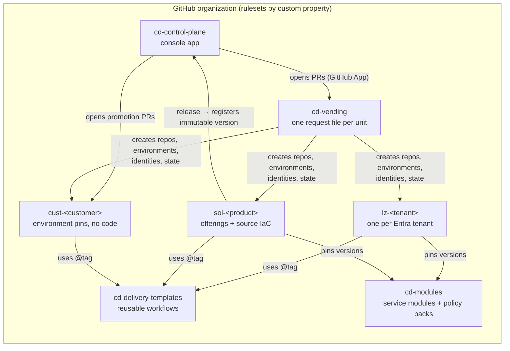

# Delivery isolation and branching strategy

How Cloud Delivery should isolate and segregate the things it delivers (platform landing zones, solutions/products,
customer installs and shared building blocks) so that each has its own CI/CD lifecycle, blast radius and approvals.
It covers how GitHub, AWS, Google Cloud and Microsoft do this at scale, where this codebase is today, and what has to
change.

**Status:** proposal · **Scope:** source control, branching, pipelines, cloud identity, Terraform state, promotion,
approvals · **Out of scope:** application runtime security of the console itself (covered only where it affects
delivery).

---

## 1. Recommendation in one page

**Don't isolate by long-lived branches. Isolate by repository, environment, identity and state, and move changes
between environments by changing version pins.** Branches stay short-lived everywhere.

Isolation at the branch level (a `customer-a` branch, an `eslz` branch, a `product-x` branch in one repository)
looks isolated but isn't:

- anyone who can read the repository can read every branch, including other customers' configuration;
- secrets, variables and cloud identities are scoped to repositories and environments, not branches;
- branches drift, and merges between them carry unrelated changes;
- "what version is customer X on?" becomes a question about merge history instead of a line in a file.

None of the four vendors reviewed uses branches as the isolation boundary. All of them give each deployable scope
its own pipeline, its own cloud identity with narrowly scoped rights, and its own Terraform state. Approvals attach
to the target environment, not to the branch (§2).

What this means for Cloud Delivery:

| Unit                             | Repository                           | Branching                                                             | Promotion                                             | Identity per                           | State per                         |
| -------------------------------- | ------------------------------------ | --------------------------------------------------------------------- | ----------------------------------------------------- | -------------------------------------- | --------------------------------- |
| Control plane (this app)         | `cd-control-plane`                   | trunk + merge queue, release tags                                     | build once, staging → prod                            | environment                            | n/a                               |
| Delivery templates               | `cd-delivery-templates`              | trunk, release tags                                                   | consumers pin by tag/SHA                              | —                                      | —                                 |
| Shared modules & policy packs    | `cd-modules`                         | trunk, per-module SemVer tags                                         | consumers pin versions                                | —                                      | —                                 |
| Platform landing zone (ESLZ/ALZ) | `lz-<tenant>` (one per Entra tenant) | trunk; plan on PR, apply on merge                                     | canary landing zone first, then version-pin PRs       | tenant × {plan, apply}                 | tenant                            |
| Solution / product               | `sol-<product>`                      | trunk; tag per offering release; servicing branches only for hotfixes | publish immutable offering version, roll out in waves | solution × sandbox                     | solution × sandbox env            |
| Customer                         | `cust-<customer>`                    | trunk; config only, no code                                           | promotion PRs bump the pinned version per environment | customer × environment × {plan, apply} | customer × environment × offering |
| Vending                          | `cd-vending`                         | trunk; one request file per unit                                      | PR → approval → vend                                  | vending (privileged, isolated)         | vending                           |

Branches are used for two things only: short-lived change branches (`feat/*`, `fix/*`, `promote/*`), and
Release Flow-style servicing branches (`release/<offering>/vX.Y`) when an old published version needs a patch.

---

## 2. How the major platforms do it

Primary sources are linked. Where a claim couldn't be verified it's called out in §2.6.

### 2.1 GitHub (the company and the product)

- **github.com ships from a monorepo through a merge queue.** Merge queue is "the single entry point for shipping
  code changes at GitHub"; ~2,500 PRs a month from 500+ engineers, main is never updated to a failing commit
  ([GitHub blog](https://github.blog/engineering/engineering-principles/how-github-uses-merge-queue-to-ship-hundreds-of-changes-every-day/)).
- **Deploy before merge, then canaries.** Branch deploys via ChatOps, through 2% → 20% canary → production with
  automated 5-minute timer gates ([GitHub blog](https://github.blog/enterprise-software/devops/improving-how-we-deploy-github/)).
- **Product controls that provide isolation:**
  - Org rulesets can target repositories by **custom properties** (e.g. `props.cd-unit:customer`); only org owners
    can edit them ([docs](https://docs.github.com/en/organizations/managing-organization-settings/creating-rulesets-for-repositories-in-your-organization)).
  - Environments: required reviewers, **prevent self-review**, wait timers (bake time), deployment branch/tag
    policies, admin bypass can be disabled, and "a job cannot access environment secrets until one of the required
    reviewers approves it"
    ([docs](https://docs.github.com/en/actions/reference/workflows-and-actions/deployments-and-environments)).
  - OIDC `sub` claims are `repo:ORG/REPO:environment:NAME` and can be customised to include `job_workflow_ref`, so
    a cloud identity trusts **one repository, one environment and one approved workflow**. Repos created after
    15 July 2026 get an immutable-ID `sub` format, and custom properties can be emitted as claims for ABAC
    ([docs](https://docs.github.com/en/actions/reference/security/oidc)).
  - CODEOWNERS is read from the PR's base branch and enforced by rulesets
    ([docs](https://docs.github.com/en/repositories/managing-your-repositorys-settings-and-features/customizing-your-repository/about-code-owners)).
  - Reusable workflows can only keep or narrow `GITHUB_TOKEN` permissions; environment secrets can't be passed in,
    the called workflow must declare the environment
    ([docs](https://docs.github.com/en/actions/reference/workflows-and-actions/reusing-workflow-configurations)).
  - GitHub Apps over PATs for automation: short-lived, fine-grained, not tied to a person
    ([docs](https://docs.github.com/en/apps/creating-github-apps/about-creating-github-apps/deciding-when-to-build-a-github-app)).

### 2.2 AWS

- **Account Factory for Terraform (AFT)** splits a platform into four repositories (account requests, provisioning
  customizations, global customizations, per-account customizations), with **one pipeline per account** and **one
  state key per account per stage** (`<account>-aft-account-customizations/terraform.tfstate`)
  ([AWS docs](https://docs.aws.amazon.com/controltower/latest/userguide/aft-account-customization-options.html)).
  A central admin role assumes a narrowly scoped execution role in each vended account
  ([AWS docs](https://docs.aws.amazon.com/controltower/latest/userguide/aft-required-roles.html)).
- **CI/CD lives in its own accounts** ("Deployments OU"), because CI needs write access to artifacts while production
  needs only read ([AWS whitepaper](https://docs.aws.amazon.com/whitepapers/latest/organizing-your-aws-environment/advanced-ous.html)).
  "Account-level separation is strongly recommended"
  ([Well-Architected SEC01-BP01](https://docs.aws.amazon.com/wellarchitected/latest/framework/sec_securely_operate_multi_accounts.html)).
- **Deployment Pipeline Reference Architecture:** "Build artifacts only once and then promote them", "discourage the
  use of long-lived branches and encourage trunk-based development"
  ([DPRA](https://pipelines.devops.aws.dev/application-pipeline/)).
- **Builders' Library:** one-box first, then waves of increasing size with **bake time** between them, automatic
  rollback on metrics
  ([Automating safe, hands-off deployments](https://aws.amazon.com/builders-library/automating-safe-hands-off-deployments/)).
- **Service Catalog** versions products; retiring a version doesn't affect what's already provisioned
  ([docs](https://docs.aws.amazon.com/servicecatalog/latest/adminguide/managing-versions.html)).

### 2.3 Google Cloud

- **Enterprise foundations blueprint** (`terraform-example-foundation`) splits the platform into stages
  (0-bootstrap, 1-org, 2-environments, 3-networks, 4-projects, 5-app-infra), **one repository per stage**, and
  "a distinct service account … for each stage" with only that stage's roles; Workload Identity Federation maps each
  repository to its stage's service account
  ([repo](https://github.com/terraform-google-modules/terraform-example-foundation)).
- It is the one vendor example that uses **environment branches**: plan on any branch, apply when merged to
  `development`, `nonproduction` or `production`. Note that it's "intended as an example to be forked".
- **Cloud Deploy** promotes the _same release_ between targets, with approval and the execution service account set
  **per target** ([docs](https://cloud.google.com/deploy/docs/promote-release)).
- **Enterprise Application Blueprint:** tenants are "isolated from one another at run time and in the CI/CD
  pipelines", and "each application has a separate Git repository"
  ([docs](https://cloud.google.com/architecture/enterprise-application-blueprint)).

### 2.4 Microsoft and Azure

- **Azure Landing Zones accelerator** bootstraps a module repo plus a separate **templates repo** for workflows,
  separate **plan (Reader)** and **apply (Owner)** managed identities at management-group scope, Plan and Apply
  environments with an approval team, and a customised OIDC subject that pins
  `repository`, `environment` and `job_workflow_ref`
  ([accelerator](https://azure.github.io/Azure-Landing-Zones/accelerator/),
  [bootstrap modules](https://github.com/Azure/accelerator-bootstrap-modules)).
- **Subscription vending:** "Use one file for each subscription request" and "a dedicated state file for each
  application landing zone subscription"
  ([Architecture Center](https://learn.microsoft.com/en-us/azure/architecture/landing-zones/subscription-vending)).
- **Enterprise Policy as Code:** GitHub Flow for simple cases, **Release Flow** for rings; separate identities for
  plan (Reader), policy deploy and role deploy
  ([EPAC](https://azure.github.io/enterprise-azure-policy-as-code/ci-cd-branching-flows/)).
- **Release Flow** (how Azure DevOps ships): trunk plus short topic branches; `releases/M###` cut per sprint;
  "release branches never merge back": fixes land on main and are cherry-picked
  ([Microsoft](https://learn.microsoft.com/en-us/devops/develop/how-microsoft-develops-devops)).
- **Safe Deployment Practices:** canary regions, then a pilot, then region-pair waves with extended bake times
  ([Azure blog](https://azure.microsoft.com/en-us/blog/advancing-safe-deployment-practices/)).
- **Azure Verified Modules** require SemVer
  ([AVM spec](https://azure.github.io/Azure-Verified-Modules/spec/SNFR17/)).
- **Entra federated credentials:** at most 20 per app registration or managed identity
  ([docs](https://learn.microsoft.com/en-us/entra/workload-id/workload-identity-federation-create-trust)), which
  favours one identity per (unit, environment, role).

### 2.5 Cross-cutting findings

- **DORA:** higher performance with "three or fewer active branches" and merging to trunk at least daily
  ([dora.dev](https://dora.dev/capabilities/trunk-based-development/)).
- **Monorepo access limits:** "Git is not designed to restrict access to certain files", which is why Flux recommends
  repo-per-team/tenant for configuration ([Flux](https://fluxcd.io/flux/guides/repository-structure/)). Argo CD
  likewise recommends separate config repos and pinning to a tag or SHA
  ([Argo CD](https://argo-cd.readthedocs.io/en/stable/user-guide/best_practices/)).
- **Terraform workspaces are not an isolation boundary** where deployments need different credentials: "each
  subsystem should have its own separate configuration and backend"
  ([HashiCorp](https://developer.hashicorp.com/terraform/cli/workspaces)).

|                   | GitHub                                | AWS                                     | Google Cloud                                    | Microsoft/Azure                                            |
| ----------------- | ------------------------------------- | --------------------------------------- | ----------------------------------------------- | ---------------------------------------------------------- |
| Unit of isolation | repo + environment                    | account                                 | stage; project/folder per env and BU            | management group / subscription                            |
| Branching         | trunk + merge queue                   | trunk                                   | environment branches (foundation)               | trunk; Release Flow for rings                              |
| Promotion         | canary % with timed gates             | build once; waves + bake                | merge to next env branch / promote same release | canary regions → waves + bake                              |
| Identity          | OIDC sub = repo + env + workflow      | admin role → per-account execution role | service account per stage                       | plan/apply identities per env, pinned to template workflow |
| State             | —                                     | one key per account per stage           | per stage                                       | one file per subscription                                  |
| Approvals         | environment reviewers, no self-review | review stage                            | approval per target                             | environment approvals, apply team                          |

### 2.6 Could not verify

Google's monorepo paper details (only the abstract was accessible); the Builders' Library text was read from a
2025-01-05 archive because the page moved. **GitHub plan dependence matters here:** environment reviewers, wait
timers and admin-bypass controls on **private** repositories, "Require workflows to pass" and required merge queue
need GitHub **Enterprise Cloud** (§9, decision 1).

---

## 3. Where we are today

What's already right, and what the proposed model builds on:

| Already in place                                                                                 | Where                                                                                                                            |
| ------------------------------------------------------------------------------------------------ | -------------------------------------------------------------------------------------------------------------------------------- |
| Published offering versions are immutable                                                        | `publishOfferingVersion` in [factory.functions.ts](../src/lib/factory.functions.ts)                                              |
| Imported solutions are pinned to a commit SHA                                                    | [catalog-import.functions.ts](../src/lib/catalog-import.functions.ts)                                                            |
| ALZ library versions are pinned                                                                  | [src/lib/alz/alz-2025.09.3.json](../src/lib/alz/alz-2025.09.3.json)                                                              |
| Desired vs actual version per customer environment                                               | `environments.desired_offering_version_id` / `actual_…` in [0001_control_plane.sql](../db/migrations/0001_control_plane.sql)     |
| Rollout waves exist in the model                                                                 | `planUpgrades`, `createRollout`, `startWave` in factory.functions.ts                                                             |
| Generated delivery design already uses per-environment OIDC subjects and plan/apply environments | `namesFor`, `deliveryWorkflow` in [onboarding.ts](../src/lib/onboarding.ts)                                                      |
| Generators are validated in CI with path filters                                                 | [validate-alz.yml](../.github/workflows/validate-alz.yml), [validate-offerings.yml](../.github/workflows/validate-offerings.yml) |
| Audit log is append-only (database trigger)                                                      | [0001_control_plane.sql](../db/migrations/0001_control_plane.sql)                                                                |

The gaps, most serious first:

1. **The console itself runs Terraform for everything.** Landing zones and offering deployments run in-process in the
   web app ([runner.server.ts](../src/lib/alz/runner.server.ts),
   [run.functions.ts](../src/lib/offering/run.functions.ts)). The web app is the control plane _and_ the executor,
   so a compromise of the web app is a compromise of every estate.
2. **One identity deploys every landing zone, solution and customer.** The app and Terraform "deploy as the same
   identity" (`DEPLOY_CLIENT_ID`, [arm.server.ts](../src/lib/alz/arm.server.ts)). A landing zone needs Owner at a
   management group, so that single identity's blast radius is everything.
3. **Terraform state is on the web app's local disk** (`/home/cloud-delivery/...`, `workDir` in runner.server.ts),
   with an in-memory lock (`running` set). There's no state encryption boundary, no lease locking across instances,
   and no per-unit access control.
4. **State keys don't isolate customers.** Offering deployments use `installs/<offeringId>/<env>`: two customers on
   the same offering and environment would share state.
5. **The designed delivery repo is shared by all customers.** `DEFAULT_DELIVERY.repo` is one repository with
   `installs/<customer>.yaml` and one matrix workflow, so everyone with read access sees every customer's
   configuration. (This path is also still simulated by the demo engine.)
6. **This repository has no guardrails.** `main` is unprotected, there are no rulesets, no CODEOWNERS and no
   environments other than Pages. There's no general CI on pull requests: type-check, lint and build only run in
   `release-app.yml` after merge.
7. **The console's own release is mutable.** `release-app.yml` republishes the `app-latest` tag on every push, with
   `contents: write` on the whole workflow. That's the same "mutable artifact" issue the catalog importer flags as a
   blocker for OneGrid.
8. **Single tenant, no sign-in.** `ORG_ID` is a constant in three server files, there's no row-level security, and
   catalog identity comes from environment variables.

---

## 4. Target model

### 4.1 Repository topology



Every repository gets custom properties that org rulesets and OIDC claims key on:

| Property         | Values                                                                                     | Used for                                  |
| ---------------- | ------------------------------------------------------------------------------------------ | ----------------------------------------- |
| `cd-unit`        | `control-plane`, `templates`, `modules`, `vending`, `landing-zone`, `solution`, `customer` | which ruleset applies; ABAC claim         |
| `cd-tenant`      | Entra tenant ID the unit deploys into                                                      | identity trust conditions                 |
| `cd-owner-team`  | GitHub team slug                                                                           | CODEOWNERS default, environment reviewers |
| `cd-criticality` | `standard`, `regulated`                                                                    | extra reviewers, longer bake time         |

Why a repository per landing zone, solution and customer, rather than folders in a monorepo:

- repository is the only GitHub boundary that separates **read access**, secrets, variables, environments and audit
  (Flux and Argo CD make the same point, §2.5);
- it maps one-to-one to AFT's per-account pipelines, Azure's one-file-per-subscription vending and Google's
  repo-per-application;
- a customer's repository can be shared with that customer's admins without exposing anyone else.

The code that's the same for everyone (templates, modules, generators) stays centralised and versioned, so per-unit
repositories hold **configuration and pins**, not copies of code.

### 4.2 Branching per repository type

All repositories: `main` is protected by an org ruleset. Squash merge, linear history, signed commits, no force
push or deletion, required status checks, CODEOWNERS review, stale approvals dismissed, admin bypass off. Change
branches are short-lived (`feat/*`, `fix/*`, bot-owned `promote/*`, `vend/*`) and deleted on merge.

| Repository              | Branches                                                                   | Tags / releases                             | What triggers what                                                                                                         |
| ----------------------- | -------------------------------------------------------------------------- | ------------------------------------------- | -------------------------------------------------------------------------------------------------------------------------- |
| `cd-control-plane`      | `main` + change branches, merge queue                                      | `vX.Y.Z` (immutable, attested)              | PR: typecheck, lint, build, generator validation. Tag: build once → staging → prod environment.                            |
| `cd-delivery-templates` | `main` + change branches                                                   | `vX.Y.Z`                                    | Consumers call `…/lz-apply.yml@v3`; identities trust only that ref.                                                        |
| `cd-modules`            | `main` + change branches                                                   | `modules/<name>/vX.Y.Z` (SemVer, AVM rules) | PR: validate + test per changed module path.                                                                               |
| `cd-vending`            | `main` + `vend/*`                                                          | —                                           | PR: plan the vend. Merge + approval: create repo, environments, identities, state.                                         |
| `lz-<tenant>`           | `main` + change branches                                                   | —                                           | PR: `plan` (plan identity). Merge: `apply` behind the `apply` environment.                                                 |
| `sol-<product>`         | `main` + change branches; `release/<offering>/vX.Y` **only** for servicing | `<offering>/vX.Y.Z` per delivery model      | PR: validate, review, cost, security scan, sandbox plan. Tag: build → sandbox deploy → verify → attest → register version. |
| `cust-<customer>`       | `main` + bot `promote/*`                                                   | —                                           | PR: plan every changed environment. Merge: apply per environment, in order, behind that environment's protection.          |

**Servicing (Release Flow):** when customers are on `sol-x` Enterprise Private v2.3 and main has moved on to 3.0, a
v2.3.1 fix lands on `main` first, then is cherry-picked to `release/enterprise-private/v2.3` and tagged there.
Servicing branches never merge back.

**Why not environment branches for landing zones (Google's model)?** They work, but they double the number of
long-lived branches per repo, and every promotion is a merge that can carry unrelated changes. Promoting by
bumping a pinned ALZ library / module version gives the same staged rollout with a one-line, reviewable diff. If
you prefer Google's model for landing zones, it fits inside `lz-<tenant>` without changing anything else here.

### 4.3 What lives in each repository

```text
lz-contoso/                       # one per Entra tenant
  landing-zone.yaml               # design answers (today's foundations.answers), ALZ library + module pins
  overrides/                      # custom archetypes, policy exceptions
  .github/workflows/lz.yml        # 10 lines: calls cd-delivery-templates/.github/workflows/lz.yml@v3

sol-grid-analytics/               # one per solution
  solution.yaml                   # catalog metadata: owners, industry, tags (today's products row)
  offerings/
    enterprise-private/manifest.json   # today's offering_versions.manifest_json
    hosted/manifest.json
  src/                            # optional source IaC (Terraform, Bicep, ARM) for imported solutions
  .github/workflows/solution.yml

cust-northgrid/                   # one per customer; configuration only
  customer.yaml                   # tenant, connection mode, owners, contacts
  environments/
    test.yaml                     # offering: grid-analytics/enterprise-private@4.2.0 + inputs
    production.yaml               # offering: grid-analytics/enterprise-private@4.1.0 + inputs
  .github/workflows/install.yml
```

`environments/<env>.yaml` is the single source of truth for "what version is customer X on", replacing
`installs/<customer>.yaml` in the shared delivery repo.

### 4.4 Identity model

One user-assigned managed identity (or app registration) per **unit × environment × role**. Plan identities read;
apply identities write, and only after the environment approves. Each federated credential trusts one repository,
one environment and one template workflow ref:

```text
repo:<org>@<orgId>/cust-northgrid@<repoId>:environment:production-apply:job_workflow_ref:<org>/cd-delivery-templates/.github/workflows/install.yml@refs/tags/v3
```

| Unit               | Identity                 | Lives in                                   | Scope                                     | Role                                                                                            |
| ------------------ | ------------------------ | ------------------------------------------ | ----------------------------------------- | ----------------------------------------------------------------------------------------------- |
| `lz-<tenant>`      | `lz-<tenant>-plan`       | that tenant                                | intermediate root MG                      | Reader + state blob reader                                                                      |
| `lz-<tenant>`      | `lz-<tenant>-apply`      | that tenant                                | intermediate root MG                      | Owner (ALZ default); ideally Contributor + Resource Policy Contributor + conditioned RBAC Admin |
| `sol-<product>`    | `sol-<product>-sandbox`  | ISV tenant                                 | that solution's sandbox subscription only | Contributor + conditioned RBAC Admin                                                            |
| `cust-<customer>`  | `cust-<c>-<env>-plan`    | customer tenant (or ISV tenant for Hosted) | that environment's subscription           | Reader                                                                                          |
| `cust-<customer>`  | `cust-<c>-<env>-apply`   | same                                       | that environment's subscription           | Contributor + conditioned RBAC Admin                                                            |
| `cd-vending`       | `vending`                | ISV tenant (+ consent in customer tenants) | subscription creation, identity creation  | privileged; used only by the vending workflow behind two-person approval                        |
| `cd-control-plane` | web app managed identity | ISV tenant                                 | its own resources only                    | **no rights in any landing zone or customer estate**                                            |

Customer-tenant identities are created during the existing `/connect/$customerId` flow, where the customer's admin
approves them, which gives the customer the ability to revoke them. The control plane talks to GitHub through a
**GitHub App** (contents and pull requests on vended repos, `actions: write` to dispatch), never a personal token.

One identity per unit × environment × role keeps each identity well under the 20-federated-credential limit (§2.4).

### 4.5 State model

| Unit                                | Backend                                                                | Key                          | Who can read/write                                         |
| ----------------------------------- | ---------------------------------------------------------------------- | ---------------------------- | ---------------------------------------------------------- |
| `lz-<tenant>`                       | storage account in that tenant's management subscription               | `lz/<tenant>.tfstate`        | the tenant's plan/apply identities only                    |
| `cust-<customer>` (customer-hosted) | storage account in the customer's own subscription, created at connect | `<offering>/<env>.tfstate`   | that customer's plan/apply identities for that environment |
| `cust-<customer>` (Hosted)          | ISV state account, one container per customer                          | `<offering>/<env>.tfstate`   | ABAC condition limits each identity to its container       |
| `sol-<product>` sandbox             | ISV sandbox state account, container per solution                      | `<offering>/sandbox.tfstate` | that solution's sandbox identity                           |

All backends: private endpoint or firewall, versioning and soft delete, blob lease locking, Entra auth only
(shared keys disabled). No state on the console's disk.

### 4.6 Promotion and rollout

```mermaid
sequenceDiagram
  participant Owner as Solution owner
  participant SOL as sol-<product>
  participant CP as Control plane
  participant C0 as Ring 0 · internal canary customer
  participant C1 as Ring 1 · early-access customers
  participant C2 as Ring 2+ · everyone else
  Owner->>SOL: merge change, tag enterprise-private/v4.3.0
  SOL->>SOL: build once · validate · sandbox deploy · verify · attest
  SOL->>CP: register v4.3.0 (immutable, digest + attestation)
  CP->>C0: promotion PR: test → 4.3.0, then production → 4.3.0
  Note over C0: environment approvals · wait timer = bake time · verify
  CP->>C1: promotion PRs (wave 1) after health gate
  CP->>C2: promotion PRs (wave 2…n); regulated customers last, longest bake
```

- **Solutions** follow build once, promote the artifact (AWS DPRA, Cloud Deploy). The release pipeline produces
  one immutable package with a digest and a GitHub artifact attestation; deploy workflows verify both.
- **Customers** follow Safe Deployment Practices and Builders' Library waves: ring 0 is an ISV-hosted canary
  customer, then opted-in early customers, then everyone, with regulated customers last. Inside a customer, dev →
  test → production are separate PRs or ordered jobs, and production waits for approvers and a wait timer.
  A failed verify or drift halts the wave. `createRollout` / `startWave` become the thing that opens these PRs.
- **Landing zones:** a change to templates, modules or the ALZ library pin goes to a canary landing zone (`lz-canary`
  in a test tenant) first, then the bot opens pin-bump PRs to each `lz-<tenant>`.

### 4.7 Segregation of duties

| Action                                      | Solution owner (SE/CSA) | Catalog reviewer | Platform (LZ) team      | Delivery engineer | Security approver          | Org admin     |
| ------------------------------------------- | ----------------------- | ---------------- | ----------------------- | ----------------- | -------------------------- | ------------- |
| Change a solution's code or manifest        | ✅ own solutions        | —                | —                       | —                 | —                          | —             |
| Publish a solution version                  | ✅ (checks must pass)   | —                | —                       | —                 | —                          | —             |
| Feature a solution                          | ❌ own                  | ✅               | —                       | —                 | —                          | —             |
| Change a landing zone                       | —                       | —                | ✅ PR                   | —                 | —                          | —             |
| Approve landing zone apply                  | —                       | —                | ✅ not the author       | —                 | ✅ for policy/RBAC changes | —             |
| Onboard a customer (vend)                   | —                       | —                | —                       | ✅ request        | ✅ approve                 | —             |
| Approve customer production                 | ❌                      | —                | —                       | ✅ not the author | ✅ regulated               | —             |
| Change delivery templates                   | —                       | —                | ✅ with security review | —                 | ✅                         | —             |
| Change rulesets, custom properties, vending | —                       | —                | —                       | —                 | —                          | ✅ two-person |

Enforced by: CODEOWNERS per path, environment required reviewers with **prevent self-review**, org rulesets that
repository admins can't bypass, separate plan and apply identities, and templates pinned in the OIDC subject so a
repository can't run a modified workflow with production credentials.

---

## 5. What needs to be done

**Status.** Checked items are built in this repository. The platform repositories are generated from code —
`src/lib/delivery/` (model, templates, scaffolds, vending) and `bun scripts/delivery-generate.ts` — and validated
in CI (`validate-delivery.yml`); **Platform → Delivery units** shows every unit's spec. Nothing is created on
GitHub or Azure until an org admin bootstraps the platform repositories and configures `CD_GITHUB_TOKEN` (see
`.env.example`). Notes on partial items:

- Org rulesets are generated in `cd-vending` targeting `lz-*`, `sol-*` and `cust-*` by name; switch the target
  to the `cd-unit` custom property once the organization defines it.
- Identities, environments and state are stored in `delivery_units.spec` (JSON) rather than separate tables.
- The in-console Terraform runner (landing zone deploy, offering test deploy) still exists and still uses
  local state; test-deploy state is now keyed per install. Moving it out is the remaining Phase 1 work.

### Phase 0: guardrails on what exists (days)

- [ ] Protect `main` in this repo with a ruleset: PR required, one review, CODEOWNERS review, required checks,
      linear history, no force push, admin bypass off.
- [x] Add a `ci.yml` that runs on every PR: `tsc --noEmit`, `eslint`, `vite build`, plus the existing
      validate-alz / validate-offerings jobs as required checks.
- [x] Add `.github/CODEOWNERS`: `src/lib/alz/**` → platform team; `src/lib/offering/**`, `src/lib/catalog*.ts` →
      solutions team; `db/**` → control-plane owners; `.github/**` → platform + security.
- [x] Make the console release immutable: `release-app.yml` builds on tag `vX.Y.Z`, uploads a versioned asset with
      an artifact attestation, and scopes `contents: write` to the publish job only. The Deploy to Azure template
      pins a version.
- [x] Key offering test-deploy state by customer and environment, not offering and environment
      (`workspace()` in run.functions.ts), so two installs can't share state even before Phase 1.
- [ ] Decide the GitHub plan (§9) and whether this repository should become private.

### Phase 1: take execution out of the console (1–2 weeks)

- [x] Create `cd-delivery-templates` with reusable workflows: `lz.yml`, `solution.yml`, `install.yml`, `drift.yml`,
      each declaring its own environments, with plan and apply jobs split.
- [ ] Move Terraform state to remote backends (§4.5) and remove local-disk state from `runner.server.ts`.
- [x] Create per-unit plan/apply identities with federated credentials pinned to repository, environment and
      template workflow (§4.4).
- [ ] Reduce `DEPLOY_CLIENT_ID` to a **sandbox-only** identity used by the offering "Test deploy" tab; remove its
      rights anywhere else.
- [ ] The console triggers work through a GitHub App (dispatch, open PRs) and reads status back through deployment
      webhooks into `offering_runs` / `foundation_runs`.

### Phase 2: vending (2–3 weeks)

- [x] Create `cd-vending` with request files `landing-zones/<tenant>.yaml`, `solutions/<slug>.yaml`,
      `customers/<code>.yaml`, one file per unit (AFT, subscription vending).
- [x] Vending workflow, behind two-person approval: create the repository from a template, set custom properties,
      create environments with reviewers and wait timers, create identities and federated credentials, create state
      containers, and register the unit in the control plane.
- [x] Wire the console: Submit a solution → vending PR for `sol-<slug>`; Onboard customer → vending PR for
      `cust-<code>`; new landing zone → vending PR for `lz-<tenant>`. The existing `/connect` flow creates the
      customer-tenant identities.
- [ ] Org rulesets keyed on `cd-unit`, so every vended repository is protected from the moment it exists.
- [x] Data model: a `delivery_units` table (type, repository, tenant, state backend, owner team) and
      `unit_identities` (unit, environment, role, client ID, scope, subject), referenced from products, foundations
      and customers.

### Phase 3: promotion and safe rollout (2–3 weeks)

- [x] Solution release pipeline: tag → build once → validate → sandbox deploy → verify → attest → register the
      immutable version with its digest.
- [ ] `createRollout` / `startWave` open promotion PRs to `cust-*` repositories in rings; wave N+1 waits on wave N's
      verify results plus bake time; any failure halts the rollout.
- [ ] Scheduled drift workflow per unit reporting into `drift_findings`.
- [x] Deploy workflows refuse artifacts without a valid attestation or with a digest that doesn't match the
      registered version.

### Phase 4: tenancy and segregation in the console (in parallel)

- [ ] Entra sign-in; map app roles to GitHub teams (solution owner, catalog reviewer, platform, delivery, security).
- [ ] Replace the `ORG_ID` constant with the signed-in organization; add row-level security per organization.
- [ ] Approvals shown in the console are GitHub environment approvals (one source of truth), not a separate
      approval table.

### Exit criteria

- No identity can deploy to more than one customer, or to more than one environment of a customer.
- The console holds no Azure rights outside its own resource group and the solution sandbox.
- Every state file is readable only by its unit's identities.
- Every production change traces to a reviewed PR, an approved environment, an attested artifact and an audit event.
- Deleting or compromising one unit's repository can't affect another unit.

---

## 6. Mapping from today's concepts

| Today                                           | Target                                                                                       |
| ----------------------------------------------- | -------------------------------------------------------------------------------------------- |
| `foundations` row + in-app Terraform run        | `lz-<tenant>` repository + `lz.yml` template; the row stores repo + status                   |
| `products` + `offerings` + `offering_versions`  | `sol-<product>` repository; published versions stay immutable rows with digest + attestation |
| `installs/<customer>.yaml` in one delivery repo | `cust-<customer>/environments/<env>.yaml`                                                    |
| `environments.desired_offering_version_id`      | written by promotion PRs; `actual_…` written by deployment webhooks                          |
| `offering_runs`, `foundation_runs`              | mirrors of GitHub workflow runs, for the console's pipeline views                            |
| `DEPLOY_CLIENT_ID` (one identity)               | per-unit plan/apply identities; `DEPLOY_CLIENT_ID` becomes sandbox-only                      |
| Local state under `/home/cloud-delivery`        | remote backends per unit                                                                     |
| Catalog import pinned to SHA                    | unchanged; the vended `sol-*` repo records the same pin                                      |

---

## 7. Risks and trade-offs

- **Repository count.** One repository per customer grows linearly. GitHub handles this, and vending automates it,
  but org-level views have to come from the console, not GitHub. At very large numbers (thousands), a sharded
  `cust-<region>-<n>` layout with per-customer environments is the fallback, at the cost of read isolation.
- **GitHub plan.** The strongest controls on private repositories need Enterprise Cloud.
- **Azure DevOps customers.** The same model maps to ADO: projects and repos per unit, environments with approvals
  and checks, workload identity federation service connections, and required templates.
- **Customer-tenant consent.** Creating identities in customer tenants needs their admin's approval, which is
  already the shape of `/connect`, but it's a real onboarding step.
- **Migration.** Existing demo data keeps working; units migrate one at a time as they're vended.

---

## 8. Glossary

- **Unit:** anything with its own lifecycle: a landing zone, a solution, a customer.
- **Plan / apply identity:** read-only and write identities for a unit and environment.
- **Ring / wave:** a group of customers that receives a version together, followed by bake time.
- **Pin:** an exact version (SemVer tag or SHA) recorded in a file, never "latest".

---

## 9. Decisions needed

1. **GitHub plan:** Enterprise Cloud (required workflows, merge queue enforcement and environment protections on
   private repositories), or Team with public/limited controls.
2. **Customer repository granularity:** per customer (recommended) or sharded.
3. **Landing zone promotion:** version-pin promotion (recommended) or Google-style environment branches.
4. **Where customer state lives:** in the customer's subscription (recommended for customer-hosted) or centrally.
5. **Azure DevOps parity:** support from Phase 1, or GitHub first.
